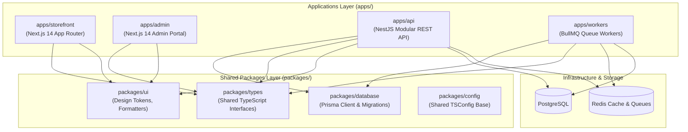

# 11 TO 11 — Project Tree Map & Monorepo Architecture

> **Brand**: 11 TO 11 Luxury Fashion Atelier & E-Commerce Platform  
> **Stack**: Turborepo, PNPM Workspaces, Next.js 14 (App Router), NestJS, Prisma ORM, BullMQ, PostgreSQL, Redis, GSAP.

---

## 1. High-Level Architecture Diagram



---

## 2. Directory Tree Map

```text
11_11_ecommerce/
├── 📁 .github/
│   └── 📁 workflows/
│       └── 📄 ci.yml                             # Monorepo CI verification (Lint, Test, Build)
│
├── 📁 apps/
│   │
│   ├── 📁 storefront/                            # Consumer-facing luxury storefront (Next.js 14 App Router)
│   │   ├── 📁 app/
│   │   │   ├── 📄 layout.tsx                     # Global layout & StorefrontShell provider
│   │   │   ├── 📄 page.tsx                       # Luxury landing & campaign showcase
│   │   │   ├── 📄 globals.css                    # Luxury design tokens, typography & themes
│   │   │   ├── 📄 sitemap.ts & robots.ts         # Automated SEO metadata
│   │   │   ├── 📁 account/                       # Customer concierge & order history
│   │   │   ├── 📁 cart/                          # Shopping bag & gift-packaging options
│   │   │   ├── 📁 category/[slug]/               # Dynamic silhouette & category pages
│   │   │   ├── 📁 checkout/                      # White-glove checkout & payment integration
│   │   │   │   └── 📁 success/                   # Order confirmation receipt & summary
│   │   │   ├── 📁 collections/                   # Curated editorial collections & lookbooks
│   │   │   │   ├── 📁 components/                # Grid, Hero, Toolbar, PhilosophyBanner
│   │   │   │   └── 📁 data/                      # Collection definitions
│   │   │   ├── 📁 products/[slug]/               # PDP, size selector, craftsmanship details
│   │   │   ├── 📁 search/                        # Real-time garment search & filters
│   │   │   ├── 📁 track/                         # Real-time 6-stage order tracking tracker
│   │   │   └── 📁 wishlist/                      # Private client wishlist
│   │   ├── 📁 components/
│   │   │   ├── 📁 home/                          # Hero, Campaign, CuratedCategories, BrandStory
│   │   │   ├── 📁 motion/                        # GSAP LuxuryRouteTransition & TransitionLink
│   │   │   ├── 📄 Header.tsx & Footer.tsx        # Navigation & concierge service links
│   │   │   ├── 📄 CartDrawer.tsx                 # Sliding cart drawer
│   │   │   ├── 📄 ProductCard.tsx                # Dynamic hover & gallery cards
│   │   │   ├── 📄 StateViews.tsx                 # Loading skeletons & empty/error states
│   │   │   └── 📄 StorefrontShell.tsx            # Context provider wrapper
│   │   ├── 📁 context/                           # CartContext & client state
│   │   ├── 📁 lib/                               # GSAP motion helpers & utilities
│   │   ├── 📁 services/                          # Typed API services (catalog, cart, order, delivery)
│   │   ├── 📄 next.config.js
│   │   ├── 📄 tsconfig.json
│   │   └── 📄 package.json
│   │
│   ├── 📁 admin/                                 # Operations & inventory backoffice (Next.js 14)
│   │   ├── 📁 app/                               # Dashboard, orders, inventory & promotions
│   │   ├── 📄 Dockerfile
│   │   ├── 📄 next.config.js
│   │   ├── 📄 tsconfig.json
│   │   └── 📄 package.json
│   │
│   ├── 📁 api/                                   # Core backend REST API (NestJS)
│   │   ├── 📁 src/
│   │   │   ├── 📄 main.ts                        # Application bootstrap & Swagger documentation
│   │   │   ├── 📄 app.module.ts                  # Root NestJS module wiring
│   │   │   ├── 📁 auth/                          # JWT authentication, guards & strategies
│   │   │   ├── 📁 cart/                          # Shopping cart state & session management
│   │   │   ├── 📁 catalog/                       # Products, categories, silhouettes & variants
│   │   │   ├── 📁 common/                        # PrismaService, auth decorators & roles guard
│   │   │   ├── 📁 inventory/                     # Stock reservation, locks & replenishment
│   │   │   ├── 📁 orders/                        # Order state machine & lifecycle management
│   │   │   ├── 📁 payments/                      # Stripe & Razorpay webhook processing
│   │   │   ├── 📁 promotions/                    # Coupons & tiered discounts engine
│   │   │   └── 📁 search/                        # PostgreSQL full-text search engine
│   │   ├── 📁 test/                              # Jest unit & integration test suites
│   │   ├── 📄 tsconfig.json
│   │   └── 📄 package.json
│   │
│   └── 📁 workers/                               # Asynchronous queue workers (BullMQ)
│       ├── 📁 src/
│       │   ├── 📄 main.ts                        # Worker microservice entry point
│       │   ├── 📄 workers.module.ts              # Redis queue registrations
│       │   └── 📁 processors/
│       │       ├── 📄 email.processor.ts         # Transactional client order & dispatch emails
│       │       └── 📄 inventory-cleanup.processor.ts # Expired reservation release cron
│       ├── 📄 tsconfig.json
│       └── 📄 package.json
│
├── 📁 packages/
│   │
│   ├── 📁 database/                              # Central Data Access Layer (Prisma ORM)
│   │   ├── 📁 prisma/
│   │   │   ├── 📄 schema.prisma                  # PostgreSQL models, enums & relations
│   │   │   └── 📄 seed.ts                        # Luxury catalog & category seed script
│   │   ├── 📁 src/index.ts                       # Shared Prisma client export
│   │   ├── 📄 tsconfig.json
│   │   └── 📄 package.json
│   │
│   ├── 📁 types/                                 # Monorepo Shared Types
│   │   ├── 📁 src/index.ts                       # Product, Order, User, Cart definitions
│   │   ├── 📄 tsconfig.json
│   │   └── 📄 package.json
│   │
│   ├── 📁 ui/                                    # Shared Design System
│   │   ├── 📁 src/
│   │   │   ├── 📄 tokens.ts                      # Champagne Gold, Noir & Atelier color tokens
│   │   │   ├── 📄 formatters.ts                  # Currency & date formatters
│   │   │   └── 📄 index.ts
│   │   ├── 📄 tsconfig.json
│   │   └── 📄 package.json
│   │
│   └── 📁 config/                                # Shared Tooling Configurations
│       ├── 📄 tsconfig.base.json                 # Shared TypeScript base configuration
│       └── 📄 package.json
│
├── 📄 docker-compose.yml                         # Local development datastores (PostgreSQL 16 + Redis 7)
├── 📄 docker-compose.prod.yml                    # Multi-container production deployment stack
├── 📄 nginx.prod.conf                            # Nginx reverse proxy configuration & caching
├── 📄 turbo.json                                 # Turborepo task pipeline configuration
├── 📄 pnpm-workspace.yaml                       # PNPM monorepo workspace definition
├── 📄 package.json                               # Monorepo root scripts & dev dependencies
└── 📄 README.md                                  # Repository documentation
```

---

## 3. Module & Service Breakdown

### Apps (`apps/`)

| App | Framework | Port | Primary Responsibilities |
| :--- | :--- | :--- | :--- |
| **`storefront`** | Next.js 14 (App Router) | `3000` | Luxury customer experience, product catalog browsing, GSAP transitions, shopping bag, white-glove checkout, order tracking. |
| **`admin`** | Next.js 14 | `3001` | Backoffice management, order fulfillment lifecycle, inventory replenishment, promotional coupon creation. |
| **`api`** | NestJS | `4000` | Core transactional backend, authentication, product inventory, order placement, payments, search indexing. |
| **`workers`** | BullMQ + NestJS | — | Background queue jobs for transactional customer emails, inventory reservation expiry cleanup. |

### Shared Packages (`packages/`)

| Package | Purpose |
| :--- | :--- |
| **`@11-11/database`** | Prisma ORM schemas, migration history, seed data, and typed client connection pool. |
| **`@11-11/types`** | Universal TypeScript types and DTOs shared across frontend, API, and workers. |
| **`@11-11/ui`** | Design system tokens (Champagne Gold `#D4AF37`, Deep Noir `#111111`), formatters, and utilities. |
| **`@11-11/config`** | Shared base configurations (`tsconfig.base.json`, linting configurations). |

---

## 4. Key Workflows & Commands

```bash
# Install all dependencies across monorepo
pnpm install

# Start development servers (Storefront, Admin, API, Workers, DB, Redis)
pnpm dev

# Generate Prisma client
pnpm --filter @11-11/database generate

# Run database migrations
pnpm --filter @11-11/database migrate

# Seed catalog & categories
pnpm --filter @11-11/database seed

# Run automated tests
pnpm test

# Build all applications via Turborepo
pnpm build
```
